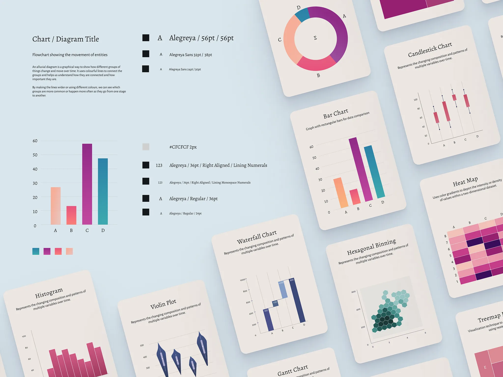
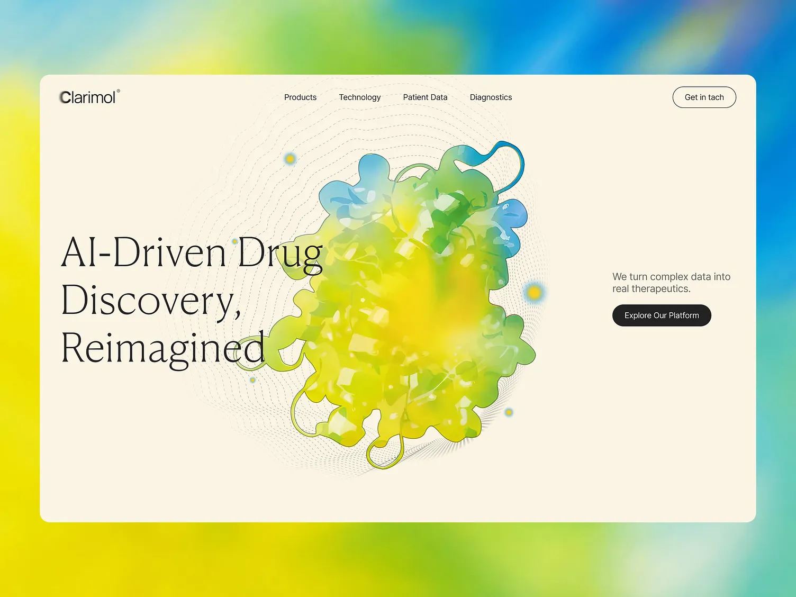
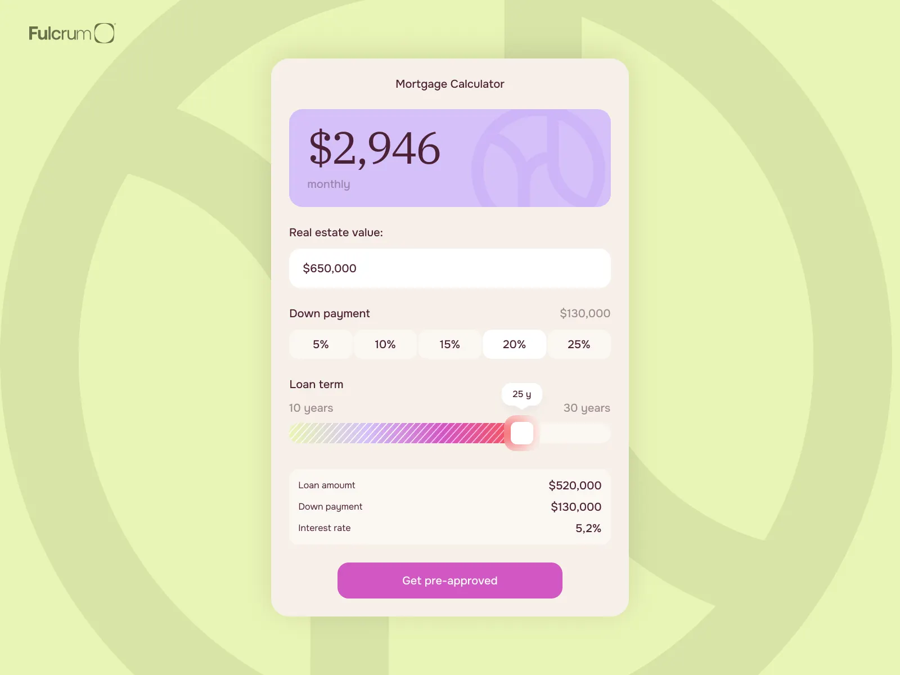

# 视觉参考与取舍

来源：用户于 2026-09-17 在当前任务提供的七张截图。原始发布链接、作者与授权范围未提供；下列文件保存原样副本，用于内部设计参考，不作为产品品牌或可直接发布的素材。截图中的文字仅是参考内容。

当前方向：研究报告式阅读结构、纸页卡片、鲜明数据色和克制文字。以 [DESIGN.md](../DESIGN.md) 的当前版本为准；下方早期有知有行及单色探索属于历史校准，不能覆盖用户最新明确的方向。

| 编号与文件 | 观察 | 借鉴点与限制 |
| --- | --- | --- |
| [R01 · 图表卡片合集](01-chart-card-collection.png) | 蓝灰背景、米白卡片、衬线图名；玫红/蓝/绿多类图形，卡片整体倾斜 | 采用底色、字体对比及数据色；实际分析页不旋转图表，不照搬三维视角 |
| [R02 · 字体与图表规范](02-chart-typography.png) | 展示 Alegreya、Alegreya Sans、数字对齐及浅灰网格 | 字体组合和细线层级的最直接依据；图片中的 pt 字号不是网页实现尺寸 |
| [R03 · 图表卡片细节](03-chart-card-detail.png) | 矩形树图、分组柱、环图；纸色圆角、衬线标题与软投影 | 参考单卡片视觉关系；叠放、阴影和留白强度在产品中收敛 |
| [R04 · 热力图与色阶](04-heatmap-and-treemap.png) | 蜜桃—玫红—深紫的数值色阶，细浅色分隔线 | 顺序色阶用于强度；金融正负指标另用发散语义；不可照搬无图例示例 |
| [R05 · 科学数据页面](05-scientific-data-page.png) | 奶油底、大号细衬线标题、细线分区、黑色曲线与局部绿色刷选 | 参考主图优先的信息布局和区间选择表达；示例医学文案及数据不属于 Candela |
| [R06 · 科学网站首页](06-editorial-science-home.png) | 纸色主面板、强字号对比、黄绿/青蓝艺术背景、克制的黑色按钮 | 借鉴首页的尺度与色彩重点；不复制标志、分子插画和文案，图表区保持纯色 |
| [R07 · 计算器组件](07-calculator-component.png) | 浅黄绿外部背景、暖色容器、紫色结果块、突出数值、分段选项与滑杆 | 用于单项结果和交互控件；补足对比度、键盘操作与非颜色状态，不新增房贷功能 |

## 可再次查看的参考

### 图表排版与字体

### 网站布局与重点色

### 数字与控件

所有色值、网页字号、断点和交互状态的项目选择均记录在 DESIGN.md；本参考表不将未观察到的交互推断成原作行为。

## 历史校准参考：有知有行（v0.2）

2026-09-17 查看[官网首页](https://www.youzhiyouxing.cn/)和[温度计](https://www.youzhiyouxing.cn/data)，保存 1440×1000 的可见页面截图。截图浏览器缺少系统中文字体，使用项目本地 Noto Sans SC 作为缺失字体回退；未改变网站的布局和色值。公开网站截图仅作内部风格参考，页面数据不用于 Candela。

- [官网首页截图](08-youzhiyouxing-home.png)：白灰阅读表面、深色正文与蓝色操作。
- [数据页截图](08-youzhiyouxing-data.png)：轻分隔线、明确的信息分区和数字层次。

Candela 借鉴其克制和阅读秩序，保留自身页面结构与品牌；收益热力图选择灰蓝发散色阶，带符号数值和完整图例。

## 当前参考：研究报告与纸页图版（v0.5）

2026-09-17 用户明确希望接近 [AI 2027](https://ai-2027.com/) 的研究报告感，并补充 [OpenAI 研究页面](https://openai.com/zh-Hans-CN/research/)。同时重新确认最初参考中的纸感与鲜明图表配色。

AI 2027 通过 Chromium 实际访问并截图：

- [R09 · 首屏](09-ai2027-top.png)：衬线字标、阅读正文、轻导航与旁侧内容。
- [R09 · 正文](09-ai2027-body.png)：连续章节、长文阅读宽度、页边信息。
- [R09 · 图表段落](09-ai2027-chart.png)：图形嵌入论述，图注与解释跟随数据。

OpenAI 研究页面的公开文本结构已读取；直接浏览器访问出现访问验证，未取得可信的实际页面截图。因此只将用户提供的参照及可读的标题、简介、主题分区、研究索引作为补充依据，不将其标记为像素级复现来源。

样板的中性纸色、中文字体、数据色板和响应式尺寸均为 Candela 的实现选择。AI 2027 的暖白正文页面与初始参考的纸卡共同提供材质方向；数据内容、品牌和研究结论均未复制。

## 当前补充：纸面层次（v0.16）

2026-09-19 按用户要求重新查看 Anthropic、ChatGPT 和有知有行，并制作三种纸面方案。当前来源、截图、观察与访问限制统一见 [纸面参考记录](paper/README.md)。本轮只比较中性纸面，不重开已经定稿的字体与紧凑排版选择。
