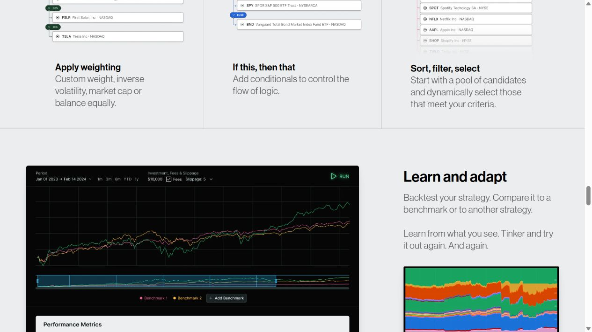
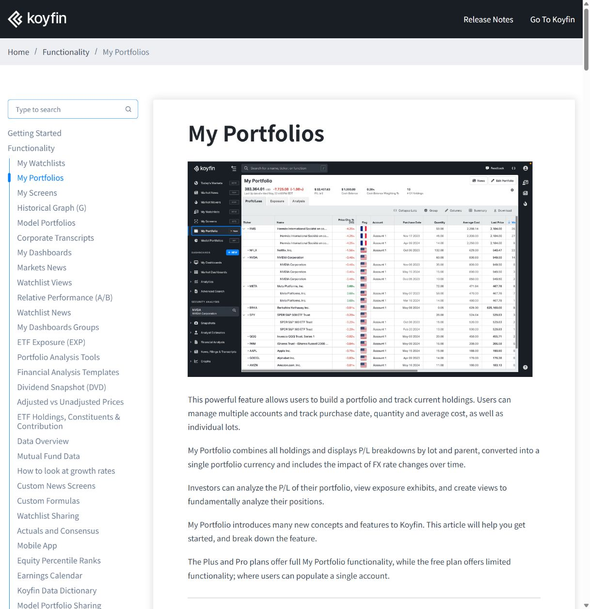
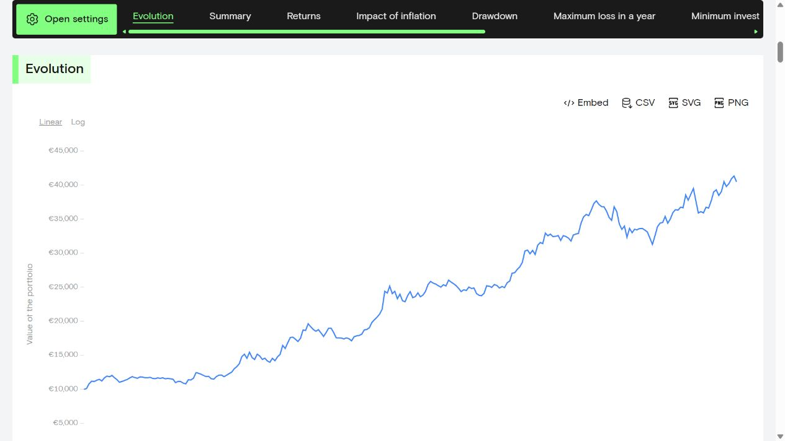

# 四 ETF 动量轮动：视觉参考板

采集日期：2026-09-16。当前状态：参考研究完成，视觉方向尚未选定。

设计简报与待确认事项：[GitHub issue #31](https://github.com/fletcherlau/candela/issues/31)。[打开并排参考板](index.html)。

本轮对象是 Candela 的四 ETF 动量轮动策略功能页。参考用于比较布局和阅读方式，不引入参考产品的交易、账户或策略编辑功能。以下判断基于官方公开页面的实际浏览器截图；Koyfin 与 Composer 的截图中包含官方展示的产品界面，并非本次登录后的实测。

## 现有实验页

来源：仓库 `etf-rotation/dca-dashboard/index.html`，在本地静态预览中采集。

保留资金曲线、持仓区间和回撤之间的联系。当前首屏把研究版本、公式和成本细节挤在标题下方，八项摘要权重接近，旧版对照贯穿页面；这些组织方式适合研究复核。面向公众的候选设计应把策略含义和表现放在主要层级，成本口径保持可见、详细规则按需展开，旧版对照作为可选查看内容。

截图中的数值来自历史模拟，不是用户实际账户或当前市场数据。页面中的 v1.3 字样与运行手册 v1.4 不一致，设计内容使用最新手册的策略版本标识。

## A. Composer：策略表现与持仓变化

来源：[Composer 官方产品页](https://www.composer.trade/)，定位到 “Learn and adapt” 区域。

- **借鉴：** 主曲线占据主要面积，时间范围靠近图表；历史配置色带让用户能把收益变化与资产变化联系起来。
- **应用：** 将策略净值、四 ETF 持仓区间与回撤放在同一条时间线上；点击日期可查看对应状态。
- **取舍：** 深色图表能突出曲线，但大面积黑底与多种亮色会提高视觉负担。借鉴结构，色彩仍需与 Candela 的方向统一。
- **边界：** 不照搬交易执行入口和可视化策略编辑器。

## B. Koyfin：紧凑、可比较的数据界面

来源：[Koyfin My Portfolios 官方帮助页](https://www.koyfin.com/help/my-portfolios/)，首张产品截图。

- **借鉴：** 顶部紧凑摘要、明确的视图切换和对齐的数字列，适合在同一屏比较多项数据。
- **应用：** 四标的摘要与历史指标使用整齐的列和明确单位，减少反复打开卡片。
- **取舍：** 密集导航和很多数据列适合熟练用户；公开产品需要保留解释入口并降低初次阅读负担。
- **边界：** 本轮仅有四个标的，无需复制全市场终端的导航复杂度。

## C. Curvo：清晰的研究阅读页

来源：[Curvo Backtest](https://curvo.eu/backtest/en)，打开公开示例 “Ray Dalio's All Weather”，定位到 “Evolution”。

- **借鉴：** 简洁的章节导航、大幅曲线、稀疏网格与直接的指标解释，便于首次访问者理解内容。
- **应用：** 将历史表现、持仓变化、回撤和策略规则组织成清楚的内容章节，术语解释随内容出现。
- **取舍：** 大幅留白和长页面降低信息密度；需要让读者能快速回到关键结论。荧光绿强调色仅作为观察对象。
- **边界：** 参考其阅读结构，不引入预测、有效前沿等本轮未要求的分析模块。

## 建议的共同原则

1. **先看懂策略，再深入指标。** 首屏展示策略名称、四标的范围、历史数据截至日期和核心图表，详细公式按需展开。
2. **收益与风险相邻。** 净值和回撤使用可关联的时间轴，持仓色带解释变化发生时持有什么。
3. **口径始终可见。** 历史回测、定投账户模拟和每日信号分开标注；累计投入、账户资产与净值收益分别表达。
4. **颜色职责固定。** 四标的有稳定身份色，现金使用中性色，涨跌或风险同时用符号与文字说明。
5. **数字便于比较。** 同类数值统一精度、右对齐并显示单位，较少使用仅为装饰的大卡片和图标。

推荐优先探索清晰的研究阅读布局，结合 Composer 的策略内容组织和 Koyfin 的数字排版。这是探索建议，尚未成为 Candela 的设计规范。

## 下一轮：同页三方向

使用相同文字、数据、功能和视口进行比较：

| 候选 | 核心特征 | 主要取舍 |
| --- | --- | --- |
| A：清晰研究页（建议优先） | 浅色、克制强调色、宽幅净值图、简洁解释 | 首次阅读友好，首屏数据密度中等 |
| B：紧凑策略工作台 | 紧凑摘要、密集比较、图表与状态并排 | 高频查看效率高，首次使用的理解成本较高 |
| C：策略解读页 | 较强标题层级、分节叙事、图表旁解释 | 便于理解策略逻辑，快速扫描效率相对低 |

先比较真实页面方案，再由开发者选定方向；选定后才写入 `docs/design/DESIGN.md`。
