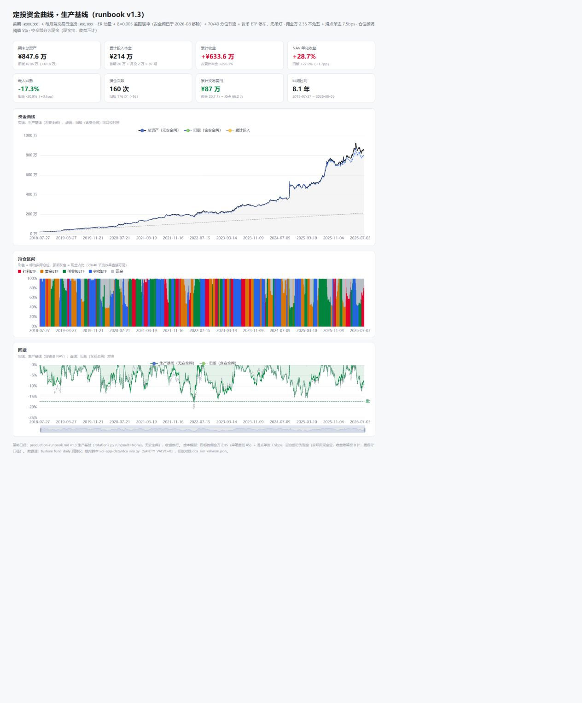
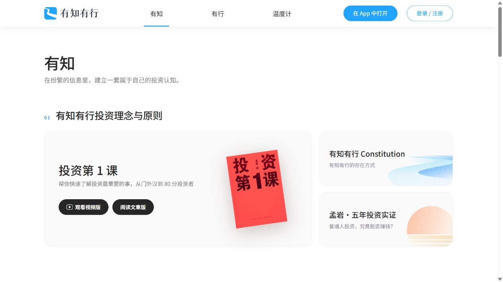
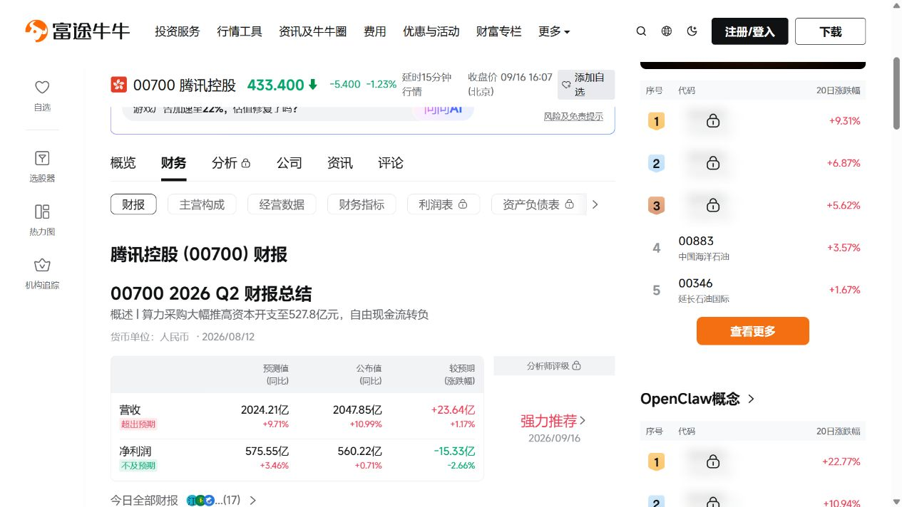
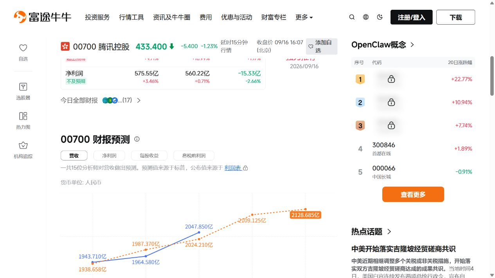
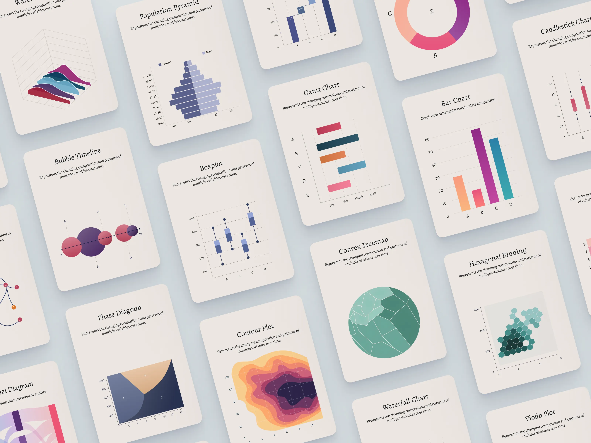

# 四 ETF 动量轮动：视觉参考板

采集日期：2026-09-16。当前状态：用户已提供三项审美参考，页面方案尚未生成与选定。

设计简报与待确认事项：[GitHub issue #31](https://github.com/fletcherlau/candela/issues/31)。[打开并排参考板](index.html)。

本轮对象是 Candela 的四 ETF 动量轮动策略功能页。用户明确喜欢有知有行、富途财报页，并特别喜欢下列 Dribbble 图表作品的视觉风格；这三项成为本轮主要参考。此前 AI 推荐的 Composer、Koyfin、Curvo 降为补充参考。

以下设计原则是基于实屏与作品的分析建议，尚非用户已确认的最终设计规范。参考中的产品功能不自动进入本项目范围。

## 现有实验页

来源：仓库 `etf-rotation/dca-dashboard/index.html`，在本地静态预览中采集。

保留资金曲线、持仓区间和回撤之间的联系。当前首屏把研究版本、公式和成本细节挤在标题下方，八项摘要权重接近，旧版对照贯穿页面；这些组织方式适合研究复核。面向公众的候选设计应把策略含义和表现放在主要层级，成本口径保持可见、详细规则按需展开，旧版对照作为可选查看内容。

截图中的数值来自历史模拟，不是用户实际账户或当前市场数据。页面中的 v1.3 字样与运行手册 v1.4 不一致，设计内容使用最新手册的策略版本标识。

## A. 有知有行：页面气质与阅读节奏

用户提供：[有知页面](https://youzhiyouxing.cn/materials)。实际浏览首屏与内容分区，保存首屏截图。

- **观察：** 白色背景、轻灰卡片、较大的圆角、清楚的黑色标题；蓝色用于品牌和小面积强调。章节编号与标题形成节奏，卡片有明确主次，文字表达亲和。
- **应用：** 用清晰的策略名称、简短解释、舒展的分区组织页面；让首次访问者读懂策略，规则与数据口径有合适的位置。
- **取舍：** 保留舒展感，但分析区压缩无效留白，给净值、持仓和回撤足够空间；不照搬其内容封面和品牌图案。

## B. 富途财报页：数据分层与比较方式

用户提供：[腾讯控股财报页](https://www.futunn.com/stock/00700-HK/earnings)。实际查看财报总结表与预测图表；仅作为界面参考，不采纳其中市场观点。

- **观察：** 概要、分区导航、表格与图表逐层展开；单位、日期靠近内容。表格数字成列，图表用标签、颜色与实虚线区分序列，局部指标切换明确。
- **应用：** 按策略概览、历史表现、持仓变化和规则分层；净值与定投资金视图在图表附近切换，日期与成本口径保持可见。
- **取舍：** 使用其组织方式和数值比较效率，保持单一主内容区；广告、热门行情侧栏和开户入口不属于本轮策略页。

## C. Data Visualization Charts — Card Deck：图表的视觉语言

用户提供：[Dribbble 作品](https://dribbble.com/shots/22974328-Data-Visualization-Charts-Card-Deck)，作者 Rahul Hareendran（rahulmax）。保存作品页面截图与原作品素材，仅作为设计研究参考。

- **观察：** 浅灰蓝底衬托暖白卡片，柔和阴影营造纸卡质感；标题带衬线字体的编辑感。细坐标轴、淡网格与图内留白使彩色数据图形突出，卡片使用同一套标题、说明和图表结构。
- **应用：** 将图表视作精排的研究卡片；以低饱和底色承托辨识度明确的资产色。标题可探索少量衬线字体，数值和密集正文保持清晰的无衬线排版。
- **取舍：** 作品中的倾斜、透视和部分三维图形服务于展示。产品图表平放并统一尺度，用折线、色带、回撤面积图等适合现有数据的形式实现；不为增加图形种类而增加无关指标。

## 组合方向：亲和的专业策略研究页

借鉴关系：**有知有行负责页面气质，富途负责数据组织，Dribbble 负责图表细节。**

共同底色倾向浅色、克制、可长时间阅读。页面层级通过排版与间距建立，数据区通过表格和局部切换提高效率，图表区允许更丰富的色彩与纸卡质感。正式色值、字体、圆角和阴影强度留到同页方案比较后确定。

## 建议的共同原则

1. **亲和外观、专业内容。** 策略名称和简短解释建立上下文，数据区保持比较效率；详细公式按需展开。
2. **收益与风险相邻。** 净值和回撤使用可关联的时间轴，持仓色带解释变化发生时持有什么。
3. **口径始终可见。** 历史回测、定投账户模拟和每日信号分开标注；累计投入、账户资产与净值收益分别表达。
4. **背景克制、图表有色。** 四标的有稳定身份色，现金使用中性色；资产颜色与盈亏语义分开，状态同时用符号与文字说明。
5. **图表精排、数字可比。** 卡片、标题、图例和说明统一，坐标轴与网格轻量但可辨；同类数字统一精度、右对齐并显示单位。

## 已确认的首屏任务

2026-09-16，用户确认：**以历史表现建立理解，同时提供醒目的收盘状态摘要，支持每日复访。** 完整范围与验收条件维护在 [设计简报 #31](https://github.com/fletcherlau/candela/issues/31)。

三版采用相同顺序：策略身份与一句话说明 → 紧凑的最新收盘状态 → 收益与风险摘要及历史图表。新用户了解策略与风险，日常复访者能快速找到数据日期、模型目标标的与仓位、相对上一交易日的变化，并展开四标的排名与原因。

目标持仓表示模型状态，不等于实际账户持仓。每日状态在原型中明确标注为示例；真实信号接入前需要解决现有服务与最新运行手册的版本差异。历史曲线默认完整区间，定投资金作为切换视图；数据未更新或不可用时，不显示为“维持不变”。

## 下一轮：同页三方向

使用相同文字、数据、功能和视口进行比较：

| 候选 | 核心特征 | 主要取舍 |
| --- | --- | --- |
| A：舒展阅读 | 更接近有知有行的主次分区、浅色大卡片和解释节奏 | 易于理解，数据密度中等 |
| B：精细分析 | 更接近富途的紧凑摘要、局部切换和列式比较 | 扫描效率高，说明需要按需展开 |
| C：图表叙事 | 更接近作品的暖白图表卡片、编辑式标题和层次配色 | 辨识度更强，需要控制装饰与留白 |

三者共同遵循上述亲和、浅色、专业的数据表达方向；探索侧重点，而不是重新探索无关的深色终端风格。先比较真实页面方案，再由开发者选定；选定后才写入 `docs/design/DESIGN.md`。

## 早期补充参考

此前由 AI 搜集，优先级低于用户指定的三个来源：

- [Composer](https://www.composer.trade/)：[截图](composer-backtest.png)。可补充观察策略曲线与历史持仓色带的关联。
- [Koyfin](https://www.koyfin.com/help/my-portfolios/)：[截图](koyfin-portfolio.png)。可补充观察数字对齐和表格密度。
- [Curvo](https://curvo.eu/backtest/en)：[截图](curvo-evolution.png)。可补充观察章节导航与指标解释。
