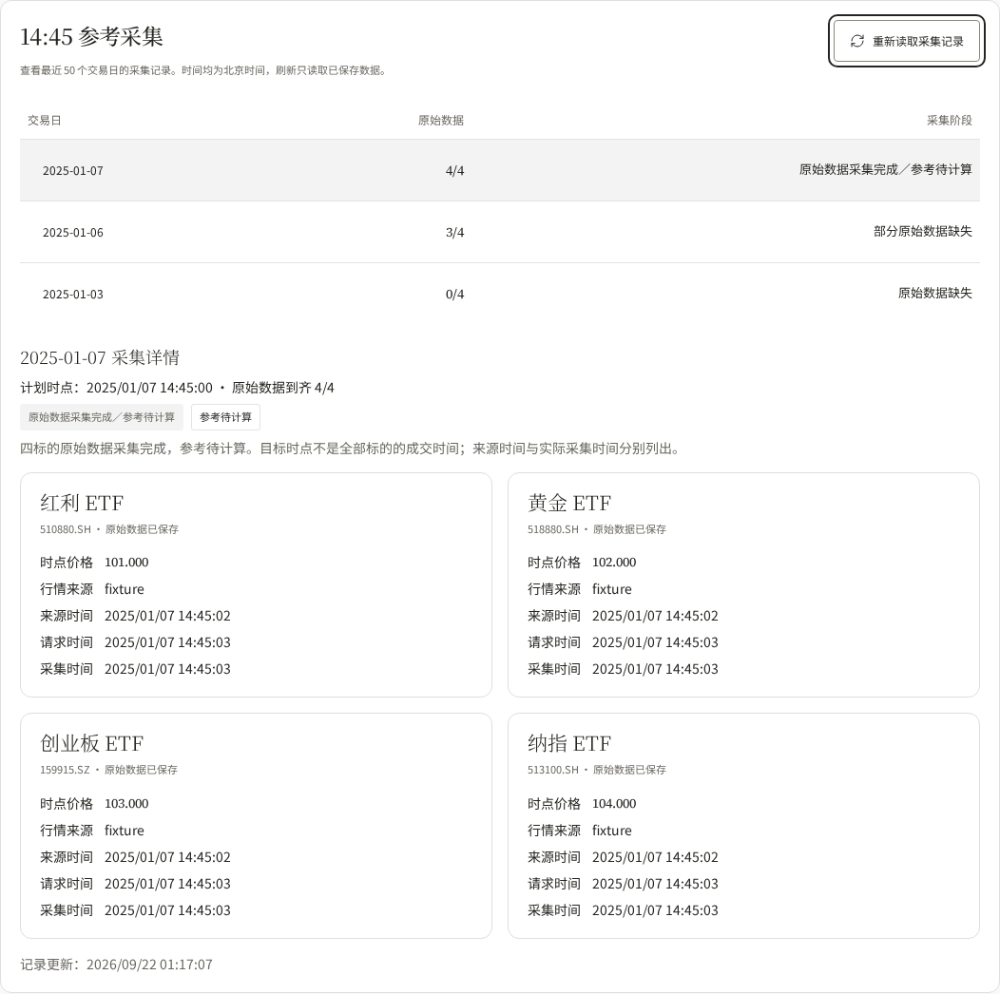
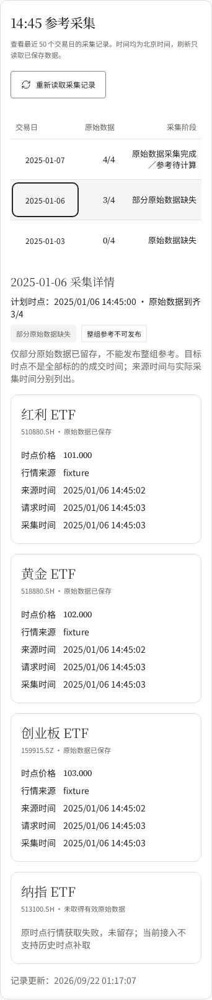

# 固定参考采集 · 管理页验收

页面：`/admin/data` 的「14:45 参考采集」。复用 ResearchTheme / shadcn；既有管理区不重新探索视觉方案。

以下截图是**隔离数据库和受控测试行情**，不是生产行情。2025-01-07 为四只采集成功，2025-01-06 为三只成功、纳指 ETF 源失败，2025-01-03 为错过原时点。源时间为 14:45:02、实际采集为 14:45:03，均由测试时钟提供；记录更新时间来自真实测试数据库时钟。测试源名 `fixture` 不代表真实供应商。





## 可复现验收

使用独立 MySQL 的 `candela_daily_test`（测试入口拒绝其他数据库名），不可与其他重置该库的验收并发运行。在 `web/frontend` 安装锁定依赖并构建后：

```sh
export ROTATION_DAILY_TEST_DSN='root@tcp(127.0.0.1:13316)/candela_daily_test?parseTime=true&loc=UTC'
npm ci
npm run build
npm run test:capture
```

环境没有系统 Chromium 依赖时需先安装 Playwright 的浏览器运行依赖。当前验收环境采用独立临时字体及运行库；测试文件不依赖这些路径。

浏览器验收在 18086 启动真实采集接口、worker、MySQL 任务，并在 18081 启动真实签名验证的网页代理。打开 Playwright UI 可交互检查：`npm run test:capture -- --ui`；选择测试运行后用浏览器模式查看 `/admin/data`。未关闭 Access 或 CSP 来完成预览；所有测试辅助入口仅编译进测试程序。

9 个流程检查通过：保存及日期切换／读取无采集副作用；1440、820、390、320px；键盘焦点保留和字体；读取失败保留原日期；实际无效签名返回认证错误；初次加载及迟到响应隔离；空档案区别于读取失败；网络悬挂 15 秒后显示超时并恢复手动重试。截图来自同一受控流程。手机四只的价格与来源／请求／采集时间、缺数原因均可读取，无整页横向溢出。

源时间证据、调度配置和剩余数据能力见 [R03 部署说明](../../deployments/r03-reference-capture.md)。本页暂不提供管理重试，六指标参考发布也仍由后续任务接续。

## 代码审查与回归

按用户固定点 `3c17415375fea02205dcb34a154875f79bb581db` 分别执行 Standards 与 Spec 审查，聚焦本票两项实现提交。Spec 无未解决发现；Standards 发现一项网络悬挂时不能重试的问题，补充整次列表／详情读取的 15 秒超时后复核通过。浏览器先复现无错误提示的失败，再验证超时和重新读取成功。

syncer 的完整 `go test -race ./...` 启用了隔离 MySQL 的轮动、每日、区间、同步和目录测试；web 完整竞态测试通过。构建与 design:check 通过，保留既有 13 个 orphaned-token 提示和构建包体积提示，不表示测试失败。
