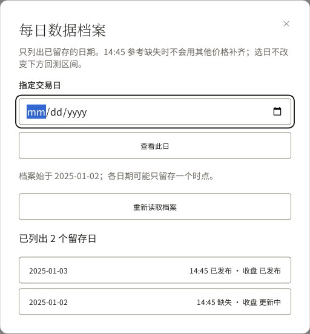
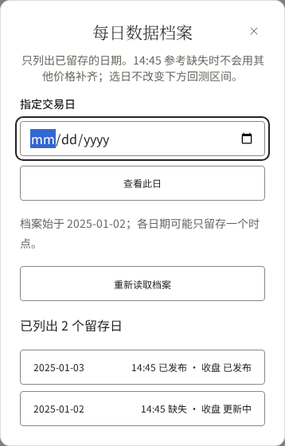

# R05 · 每日历史日期验收

对应 [#39](https://github.com/fletcherlau/candela/issues/39)。在 `/strategies/four-etf-rotation` 的每日区选择历史日期、查看该日两时点记录，再返回最新。每日日期和历史回测范围分别保存，互不重置。

## 截图与数据来源

以下为**隔离数据库和受控行情验收截图，不是生产行情**，沿用 R04 的测试数据：2025-01-03 有固定参考及收盘，01-02 仅收盘。01-02 的“更新中”来自新输入修订后保留旧完整结果的真实状态；受影响历史结果的后台重算由 R07 接续，不把旧数据标为刚更新。





[桌面历史日](desktop.png) · [手机历史日](mobile.png) · [320px 历史日](narrow.png)

测试参考源为“验收测试行情”，收盘来源文案沿用 Tushare 适配契约，实际价格由测试源写入。分位窗口为验算所用的 5 个有效值，生产默认 1200 未变。状态更新时间来自隔离数据库实际时钟，行情归属日期与受控计算时钟分开标识。

## 交互与边界

- “选择历史日期”列出后端真实保存的日期及参考／收盘状态，按日期游标加载更早记录；可以输入日期检查无记录日。
- “真实留存始于”来自档案索引，独立于行情和回测起点。每日档案不套用十年回测观察上限。
- 选择期间清除别的日期内容；只接受当前请求日期的响应。失败不会把最新结果放到历史日期下。相同日期刷新失败仍可保留明确标注日期的已读数据。
- 自动刷新和切回前台保持所选历史日期。“回到最新”才恢复后端默认选择。后续补齐收盘后，仍在所选日期读到同日新增结果，首次参考不变。
- 日期列表错误、空档案、未来日期校验与每日读取错误分别呈现，不阻断下方回测。对话框保留主题、标签和键盘焦点恢复，手机列表保持触摸面积。

## 可复现预览

仅使用隔离数据库；不要与重置同库的其他验收并发运行。在 `web/frontend`：

```sh
export ROTATION_DAILY_TEST_DSN='root@tcp(127.0.0.1:13316)/candela_daily_test?parseTime=true&loc=UTC'
export ROTATION_RANGE_TEST_DSN='root@tcp(127.0.0.1:13316)/candela_range_test?parseTime=true&loc=UTC'
npm ci
npm run build
npm run test:history
```

需要可用的 Playwright Chromium 系统运行依赖。`npm run test:history -- --ui` 可打开交互验收，运行对应场景并检查页面。配置启动真实服务（18087）、回测服务（18085）和签名鉴权网页代理（18081）；未绕过 Cloudflare Access 或 CSP，辅助控制器仅在测试程序中存在，不是生产接口。未宣称预览常驻。

10 项浏览器验收覆盖独立范围、轮询保持选择、1440 / 820 / 390 / 320px、键盘焦点、迟到响应、错误／空档案、未来日期、真实 35 日记录分页，以及所选日期后来发布收盘而参考不变。分页场景通过真实采集提交产生过时点的缺失记录，源请求计数保持不变。

后端通过真实 HTTP／MySQL 验证按日期稳定分页、2010 年记录不被十年上限截断、只留存收盘、仅采集记录、空档案、显式无记录日、非法／未来日期、重复参数和读取无取数副作用。代理测试验证真实签名鉴权、同源／CSRF 后仍拒绝写入、精确允许路径、服务密钥隔离和 HEAD 响应。

## 审查与剩余工作

固定点仍为 `3c17415375fea02205dcb34a154875f79bb581db`，Standards / Spec 两轴聚焦本票相对 R04 的实现，均未发现未解决问题。完整 syncer 竞态测试（启用隔离数据库）、web 竞态测试、构建及设计检查通过。浏览器共 71 项通过：历史 10、双时点 9、每日 7、基础页面 22、区间 9、采集 9、设计 5。构建保留现有 13 个 orphaned-token 与包体积提示。

R06 管理重试、R07 历史更正传播及最终生产发布仍在后续。当前集成不具备历史 14:45 补取能力，日期选择不会制造未留存的参考。
