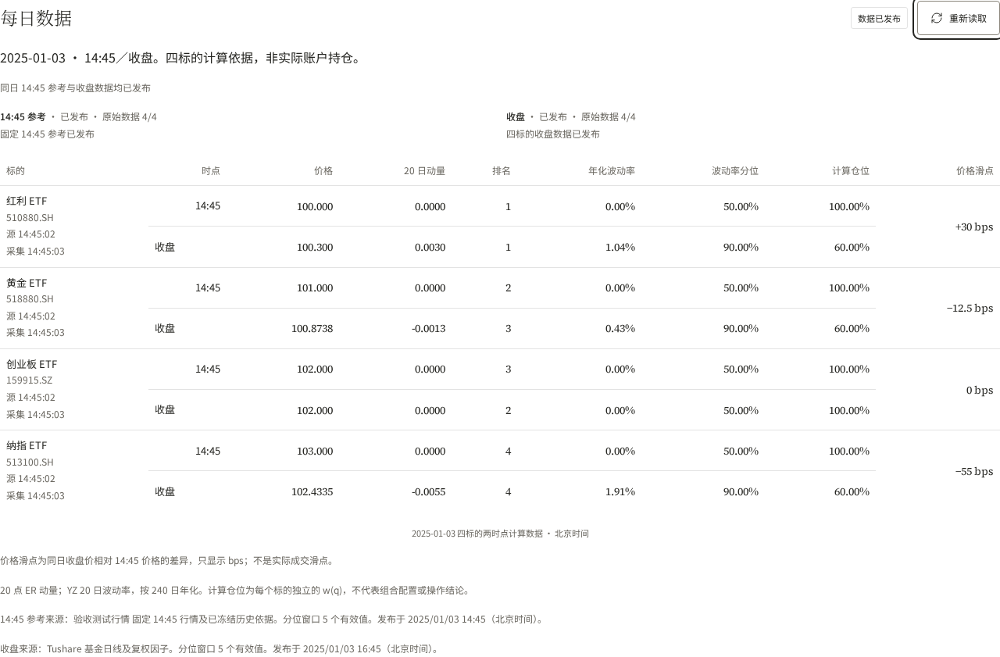
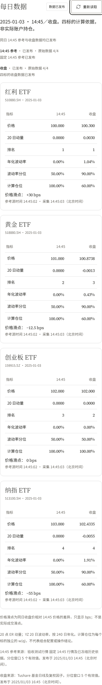

# R04 · 每日双时点数据验收

对应 [#38](https://github.com/fletcherlau/candela/issues/38)。页面 `/strategies/four-etf-rotation` 沿用 ResearchTheme、shadcn/ui 及原有 ECharts 回测；不重新选择视觉方案。

## 数据与截图

以下为**隔离 MySQL、受控行情和时钟的验收截图，不是真实市场数据或生产页面**。测试交易日为 2025-01-03，前一日为 01-02。四只参考价为 100、101、102、103，收盘变化分别为 +30、−12.5、0、−55 bps。参考源名为“验收测试行情”；收盘来源文案沿用生产 Tushare 适配契约，测试实际由受控源写入。测试采用 5 个有效波动率值的分位窗口以便验算，生产默认窗口仍为 1200；20 点 ER 动量和 YZ 波动率公式不变。





[820px 截图](tablet.png) · [320px 截图](narrow.png) · [参考缺失但收盘完整](mobile-missing.png)

桌面使用对应行，手机每只标的使用“指标／14:45／收盘”三列。价格差异仅展示带方向的 bps；计算仓位仍是每只的 w(q)，不构成组合配置或操作建议。参考来源时间和采集时间分别显示。参考缺失不阻止完整收盘展示，也不填零或伪造排名。

## 可复现验收与预览

仅使用两个隔离数据库，测试入口拒绝其他名称；禁止与重置同库的测试并发运行。安装锁定依赖并构建后，在 `web/frontend`：

```sh
export ROTATION_DAILY_TEST_DSN='root@tcp(127.0.0.1:13316)/candela_daily_test?parseTime=true&loc=UTC'
export ROTATION_RANGE_TEST_DSN='root@tcp(127.0.0.1:13316)/candela_range_test?parseTime=true&loc=UTC'
npm ci
npm run build
npm run test:reference
```

需要本机可用的 Playwright Chromium 运行依赖。`npm run test:reference -- --ui` 可打开交互验收，选择场景运行后检查页面。测试自动启动真实后端（18087）、历史回测（18085）和签名鉴权网页代理（18081）；测试浏览器持有效签名，普通未登录请求仍受保护。状态切换控制器只存在于测试程序，不编译进生产服务。本文不宣称预览服务常驻。

9 项新增浏览器验收通过：上一日→参考→收盘 3/4→双时点；四种宽度及键盘焦点；错过时点、收盘单独发布；读取失败和真实无效签名；迟到及日期不匹配响应；管理页参考发布状态。现有每日 7、基础页面 22、区间 9、采集 9、设计 5、同步 1 项回归同时通过，共 62 项。来源请求计数证明读取与页面刷新不会重新请求行情。

后端完整竞态回归启用真实隔离 MySQL，覆盖首次参考不可变、固定参数、整组发布、停牌与未知缺口、默认阶段及回退、缺失／非正／非有限参考价、结构化缺数原因。审查补充了升级中断恢复和交易日回退时日历漏项的真实 HTTP 验收。web 完整竞态测试、构建、design:check 均通过；保留已有的 13 个 orphaned-token 与包体积提示。

## 审查

按固定点 `3c17415375fea02205dcb34a154875f79bb581db` 执行 `$code-review` 的 Standards / Spec 两轴审查，聚焦本票相对 R03 的变化。Standards 原发现迁移重放 P1，改为锁内检查列定义并补充中断恢复验收后复核通过；Spec 原发现交易日回退日历缺项 P2，增加明确的日历不可用状态及前后时点验收后复核通过。两轴均无未解决发现。

## 范围与后续

本票提供参考整组发布、后端日期选择、两时点数据和 bps，不改变历史模拟计算或鉴权。R05 接续日期选择与记录索引，R06 接续管理重试，R07 接续历史收盘更正传播。当前没有历史 14:45 报价补取适配器，未记录原时点的日期明确缺失。

生产升级、外部 14:45 触发和域名发布尚未执行，将在全部任务完成后统一验证。实现边界与升级说明见 [R04 部署说明](../../deployments/r04-reference-publication.md)。
